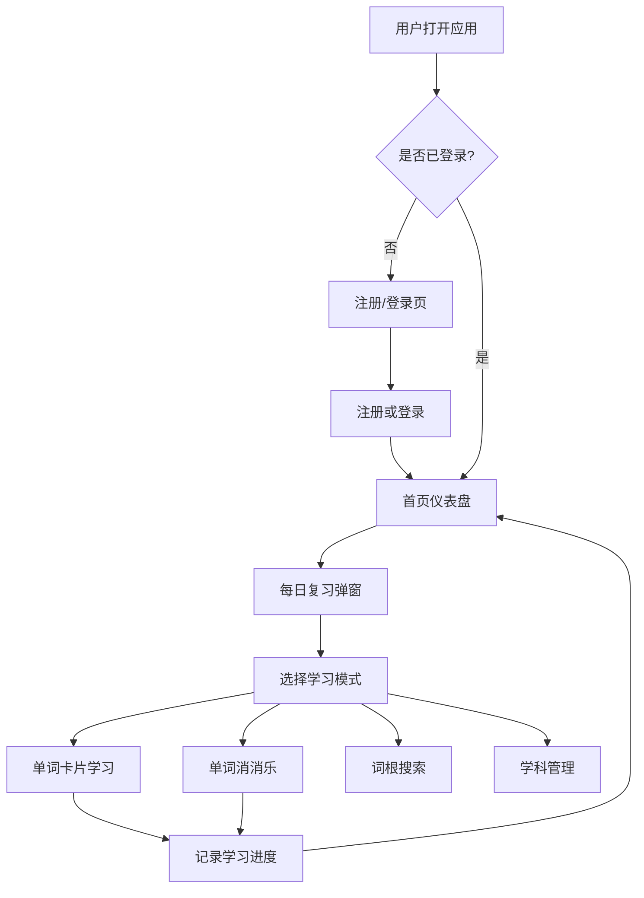

## 1. 产品概述

医学术语通（MedTerm）是一款面向医学生的医学专有名词背诵软件，支持中英双语学习。通过分学科记忆、互动式学习模块和智能进度追踪，帮助医学生高效掌握医学专业词汇。

- 目标用户：医学生、医学相关从业者
- 核心价值：系统化、趣味化的医学词汇记忆工具，解决医学词汇量大、记忆困难的问题

## 2. 核心功能

### 2.1 用户角色

| 角色 | 注册方式 | 核心权限 |
|------|----------|----------|
| 普通用户 | 邮箱注册+密码登录 | 全部功能 |

### 2.2 功能模块

1. **登录注册页**：用户注册、登录、密码找回
2. **首页/仪表盘**：学习概览、今日任务、进度统计、每日提醒弹窗
3. **单词学习页**：分学科单词浏览、单词卡片翻转记忆、医学文献例句展示
4. **单词消消乐**：基于医学词汇的配对消除游戏
5. **搜索页**：词根搜索、单词详情查看
6. **学科管理页**：预设学科（系统解剖学、有机化学等）、自定义添加学科
7. **学习统计页**：详细学习进度、掌握度分析、学习日历

### 2.3 页面详情

| 页面名称 | 模块名称 | 功能描述 |
|----------|----------|----------|
| 登录注册页 | 登录表单 | 邮箱+密码登录，表单验证 |
| 登录注册页 | 注册表单 | 邮箱+密码+确认密码注册，密码强度提示 |
| 首页仪表盘 | 今日概览 | 今日待学单词数、已掌握单词数、连续学习天数 |
| 首页仪表盘 | 每日提醒弹窗 | 弹出历史记忆单词进行复习提醒 |
| 首页仪表盘 | 快捷入口 | 进入学习、消消乐、搜索的快捷卡片 |
| 首页仪表盘 | 学科进度 | 各学科学习进度环形图 |
| 单词学习页 | 学科选择 | 下拉选择学科分类 |
| 单词学习页 | 单词卡片 | 翻转卡片，正面英文/中文，反面中文/英文+释义 |
| 单词学习页 | 例句展示 | 该单词在医学文献中的真实例句 |
| 单词学习页 | 操作按钮 | 认识/不认识，自动记录学习状态 |
| 单词消消乐 | 游戏面板 | 4x4或6x6网格，英文-中文配对消除 |
| 单词消消乐 | 计分系统 | 计时、得分、消除动画 |
| 单词消消乐 | 学科选择 | 选择特定学科的词汇进行游戏 |
| 搜索页 | 搜索框 | 支持词根搜索、模糊匹配 |
| 搜索页 | 搜索结果 | 单词卡片列表，含中英文、释义、所属学科 |
| 搜索页 | 单词详情 | 点击展开完整释义、例句、词根分析 |
| 学科管理页 | 预设学科列表 | 系统解剖学、有机化学等预设学科 |
| 学科管理页 | 添加学科 | 自定义学科名称，添加单词 |
| 学科管理页 | 学科内单词管理 | 查看/添加/编辑学科下的单词 |
| 学习统计页 | 总览统计 | 总单词数、掌握数、学习时长 |
| 学习统计页 | 学科分析 | 各学科掌握率柱状图 |
| 学习统计页 | 学习日历 | 热力图展示每日学习活跃度 |

## 3. 核心流程

## 4. 用户界面设计

### 4.1 设计风格

- **主色调**：深色医学主题 — 深蓝灰背景 `#0f1923`，主色医学蓝 `#3b82f6`，辅助色青绿 `#06b6d4`
- **强调色**：金色 `#f59e0b` 用于成就和进度，红色 `#ef4444` 用于错误/不认识
- **按钮风格**：圆角半透明玻璃态按钮，悬停时发光效果
- **字体**：标题使用 Georgia 衬线体（医学权威感），正文使用 system-ui 无衬线（清晰易读）
- **布局风格**：卡片式布局，左侧导航栏，右侧内容区
- **视觉特色**：DNA双螺旋装饰线条、分子结构六边形背景纹理、微妙的脉冲动画

### 4.2 页面设计概览

| 页面名称 | 模块名称 | UI元素 |
|----------|----------|--------|
| 登录注册页 | 登录/注册表单 | 居中卡片，深色背景+分子纹理，左侧品牌区，右侧表单，渐变边框发光 |
| 首页仪表盘 | 今日概览 | 三张统计卡片横向排列，数字大而醒目，渐变图标 |
| 首页仪表盘 | 每日提醒弹窗 | 模态弹窗，模糊背景，单词卡片翻转动画，操作按钮 |
| 首页仪表盘 | 学科进度 | 环形进度图，各学科不同颜色，悬停显示详情 |
| 单词学习页 | 单词卡片 | 3D翻转卡片动画，正面单词+音标，反面释义+例句，渐变边框 |
| 单词学习页 | 例句展示 | 折叠面板，文献来源标注，中英对照 |
| 单词消消乐 | 游戏面板 | 六边形网格布局，卡片翻转配对，消除粒子特效，计时器+得分 |
| 搜索页 | 搜索框 | 大号居中搜索框，实时搜索建议下拉，词根高亮 |
| 学科管理页 | 学科列表 | 卡片网格，每个学科独立卡片，图标+名称+单词数 |
| 学习统计页 | 统计图表 | 柱状图、热力图，数据可视化，动画过渡 |

### 4.3 响应式设计

- 桌面端优先设计（1920px基准），适配平板和移动端
- 移动端左侧导航收为汉堡菜单
- 消消乐游戏移动端适配触摸操作

## 5. 数据来源

- 预设系统解剖学、有机化学、生物化学、病理学、药理学五个学科的医学词汇
- 每个学科预置15-20个核心词汇，含中英文、释义、例句
- 用户可自定义添加学科和词汇