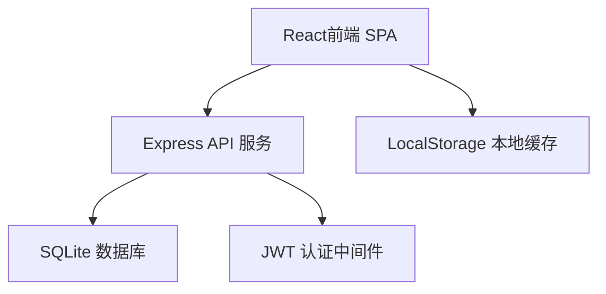
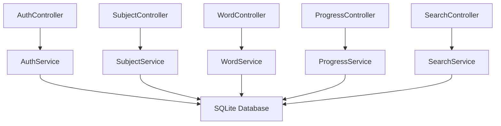
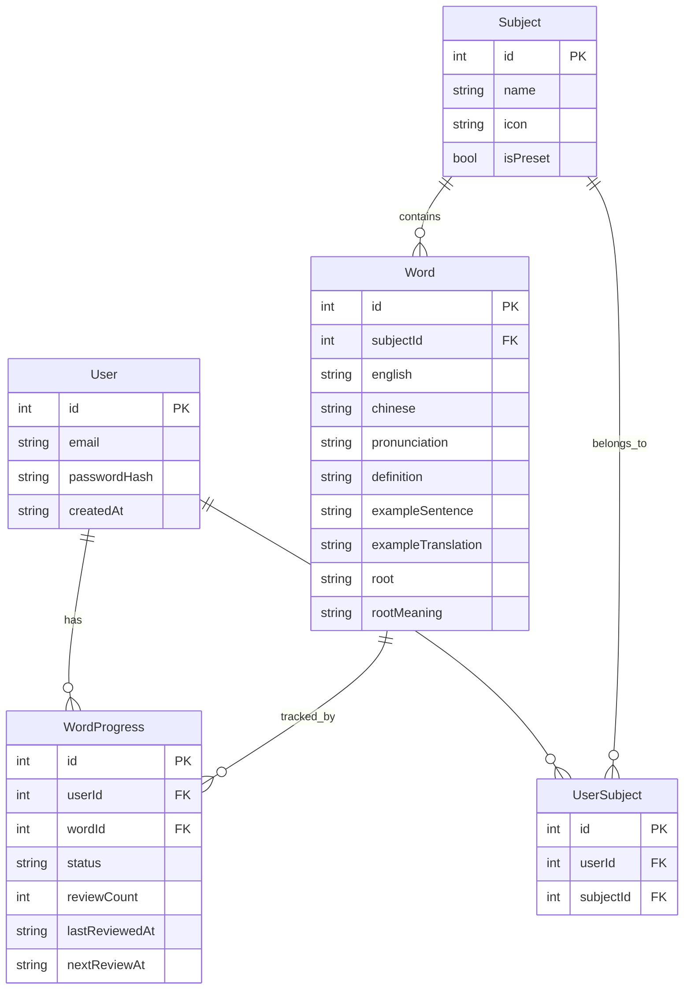

## 1. 架构设计



## 2. 技术选型

- **前端**：React@18 + TailwindCSS@3 + Vite
- **初始化工具**：Vite
- **后端**：Express@4
- **数据库**：SQLite（better-sqlite3）
- **认证**：JWT（jsonwebtoken）
- **密码加密**：bcryptjs
- **图表**：Recharts（学习统计图表）
- **动画**：Framer Motion（卡片翻转、页面过渡）
- **游戏**：纯CSS+React状态管理（消消乐）

## 3. 路由定义

| 路由 | 页面 | 说明 |
|------|------|------|
| /login | 登录注册页 | 未登录默认页 |
| / | 首页仪表盘 | 需登录 |
| /learn | 单词学习页 | 需登录 |
| /game | 单词消消乐 | 需登录 |
| /search | 搜索页 | 需登录 |
| /subjects | 学科管理页 | 需登录 |
| /stats | 学习统计页 | 需登录 |

## 4. API 定义

### 4.1 认证相关

```typescript
// POST /api/auth/register
interface RegisterRequest {
  email: string;
  password: string;
}
interface RegisterResponse {
  success: boolean;
  token: string;
  user: { id: number; email: string; createdAt: string; };
}

// POST /api/auth/login
interface LoginRequest {
  email: string;
  password: string;
}
interface LoginResponse {
  success: boolean;
  token: string;
  user: { id: number; email: string; };
}
```

### 4.2 学科相关

```typescript
// GET /api/subjects
interface Subject {
  id: number;
  name: string;
  icon: string;
  isPreset: boolean;
  wordCount: number;
  masteredCount: number;
}

// POST /api/subjects
interface CreateSubjectRequest {
  name: string;
  icon: string;
}

// DELETE /api/subjects/:id
// 仅可删除自定义学科
```

### 4.3 单词相关

```typescript
// GET /api/subjects/:subjectId/words
interface Word {
  id: number;
  english: string;
  chinese: string;
  pronunciation: string;
  definition: string;
  exampleSentence: string;
  exampleTranslation: string;
  root: string;
  rootMeaning: string;
}

// POST /api/subjects/:subjectId/words
interface CreateWordRequest {
  english: string;
  chinese: string;
  pronunciation?: string;
  definition: string;
  exampleSentence?: string;
  exampleTranslation?: string;
  root?: string;
  rootMeaning?: string;
}

// DELETE /api/words/:id
// 仅可删除自定义单词
```

### 4.4 学习进度相关

```typescript
// POST /api/progress
interface UpdateProgressRequest {
  wordId: number;
  status: 'known' | 'unknown';
}

// GET /api/progress
interface ProgressResponse {
  totalWords: number;
  masteredWords: number;
  streak: number;
  dailyStats: { date: string; count: number; }[];
  subjectProgress: { subjectId: number; subjectName: string; total: number; mastered: number; }[];
}

// GET /api/progress/review
// 获取今日需要复习的单词列表
interface ReviewWord extends Word {
  lastReviewedAt: string;
  reviewCount: number;
}
```

### 4.5 搜索相关

```typescript
// GET /api/search?q=keyword&type=root
interface SearchResult {
  words: Word[];
  relatedRoots: string[];
}
```

## 5. 服务端架构



## 6. 数据模型

### 6.1 ER 图



### 6.2 DDL

```sql
CREATE TABLE users (
  id INTEGER PRIMARY KEY AUTOINCREMENT,
  email TEXT UNIQUE NOT NULL,
  password_hash TEXT NOT NULL,
  created_at TEXT DEFAULT (datetime('now'))
);

CREATE TABLE subjects (
  id INTEGER PRIMARY KEY AUTOINCREMENT,
  name TEXT NOT NULL,
  icon TEXT DEFAULT '📚',
  is_preset INTEGER DEFAULT 0
);

CREATE TABLE words (
  id INTEGER PRIMARY KEY AUTOINCREMENT,
  subject_id INTEGER NOT NULL REFERENCES subjects(id),
  english TEXT NOT NULL,
  chinese TEXT NOT NULL,
  pronunciation TEXT DEFAULT '',
  definition TEXT DEFAULT '',
  example_sentence TEXT DEFAULT '',
  example_translation TEXT DEFAULT '',
  root TEXT DEFAULT '',
  root_meaning TEXT DEFAULT ''
);

CREATE TABLE word_progress (
  id INTEGER PRIMARY KEY AUTOINCREMENT,
  user_id INTEGER NOT NULL REFERENCES users(id),
  word_id INTEGER NOT NULL REFERENCES words(id),
  status TEXT DEFAULT 'unknown',
  review_count INTEGER DEFAULT 0,
  last_reviewed_at TEXT,
  next_review_at TEXT,
  UNIQUE(user_id, word_id)
);

CREATE TABLE user_subjects (
  id INTEGER PRIMARY KEY AUTOINCREMENT,
  user_id INTEGER NOT NULL REFERENCES users(id),
  subject_id INTEGER NOT NULL REFERENCES subjects(id),
  UNIQUE(user_id, subject_id)
);
```

### 6.3 预设数据

预设5个学科，每个学科15-20个核心医学词汇，包含系统解剖学、有机化学、生物化学、病理学、药理学。